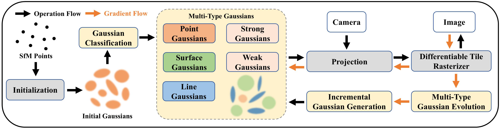

# MT-Gaussians: Multi-Type Gaussian Representation for High-Fidelity 3D Splatting



MT-Gaussians employs a multi-type gaussian representation to enhance the accuracy and adaptability of 3D scene reconstruction. First, gaussians are categorized into point, line, and surface types to precisely capture different geometric and texture features. Then, leveraging the Multi-Type Gaussian Evolution (MTGE), we introduce the concepts of strong and weak Gaussians—Strong Gaussians remain stable during optimization to accurately represent scene structures, while Weak Gaussians exhibit greater adaptability, dynamically adjusting their types. Through splitting, cloning, and merging operations, the density is effectively controlled to better fit different regions. Finally, an Incremental Gaussian Generation strategy is adopted, utilizing a convolution-based approach to iteratively fill under-reconstructed areas, enhancing scene completeness and reconstruction accuracy, ultimately achieving high-fidelity 3D Gaussian reconstruction.

## 🚀 Setup
### Environment
Ubuntu 22.04.1 LTS, GeForce 3090,  11.7, C++17

### Clone the repo.

```
git clone https://github.com/tapowanliwuyun/MT_Gaussians.git
```
### Environment setup 

```
conda env create --file environment.yml
```
or
```
conda create -n mt_gaussians python=3.7
conda activate mt_gaussians
conda install pytorch==1.13.1 torchvision==0.14.1 torchaudio==0.13.1 pytorch-cuda=11.7 -c pytorch -c nvidia
pip install submodules/diff-gaussian-rasterization
pip install submodules/simple-knn
pip install plyfile tqdm opencv-python lpips 
```

## Run our codes 

```
python scripts/run_demo.py
```

## 🎫 Acknowledgment
This project largely references [3D Gaussian Splatting](https://github.com/graphdeco-inria/gaussian-splatting) and [Mip-Splatting](https://github.com/autonomousvision/mip-splatting). Thanks for their amazing works!
