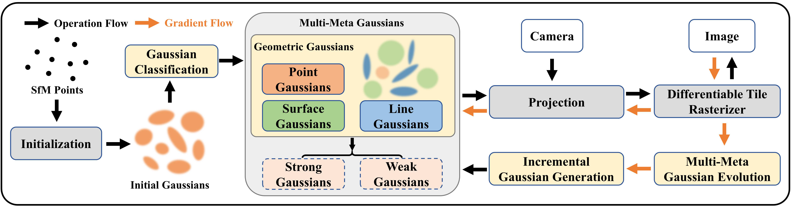

# MMG-Gaussians: Multi-Meta Geometric Gaussians Representation for High-Fidelity 3D Splatting



MMG-Gaussians employs a Multi-Meta Geometric Gaussians representation to enhance the accuracy and adaptability of 3D scene reconstruction. First, gaussians are categorized into point, line, and surface types to precisely capture different geometric and texture features. Then, leveraging the Multi-Meta Gaussians Evolution, we introduce the concepts of Strong and Weak Gaussians. Strong Gaussians remain stable during optimization to accurately represent scene structures, while Weak Gaussians exhibit greater adaptability, dynamically adjusting their types. Through splitting, cloning, and merging operations, the density is effectively controlled to better fit different regions. Finally, an Incremental Gaussians Generation strategy is adopted, utilizing a convolution-based approach to iteratively fill under-reconstructed areas, enhancing scene completeness and reconstruction accuracy, ultimately achieving high-fidelity 3D Gaussian reconstruction.

## 🚀 Setup
### Environment
Ubuntu 22.04.1 LTS, GeForce 3090,  11.7, C++17

### Clone the repo.

```
git clone https://github.com/tapowanliwuyun/MMG_Gaussians.git
```
### Environment setup 

```
conda env create --file environment.yml
```
or
```
conda create -n mmg_gaussians python=3.7
conda activate mmg_gaussians
conda install pytorch==1.13.1 torchvision==0.14.1 torchaudio==0.13.1 pytorch-cuda=11.7 -c pytorch -c nvidia
pip install submodules/diff-gaussian-rasterization
pip install submodules/simple-knn
pip install plyfile tqdm opencv-python lpips 
```

## Run our codes 

```
python scripts/run_demo.py
```
Since the project is still ongoing, we are currently unable to release the full code. We will make all of our code publicly available as soon as the paper is accepted and we are permitted to do so, in order to facilitate further research and discussion.


If you're interested in our project, feel free to contact us! We look forward to connecting with you!

## 🎫 Acknowledgment
This project largely references [3D Gaussian Splatting](https://github.com/graphdeco-inria/gaussian-splatting) and [Mip-Splatting](https://github.com/autonomousvision/mip-splatting). Thanks for their amazing works!
